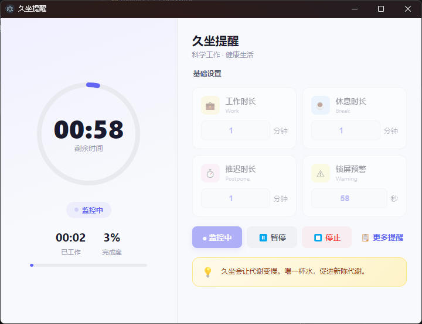
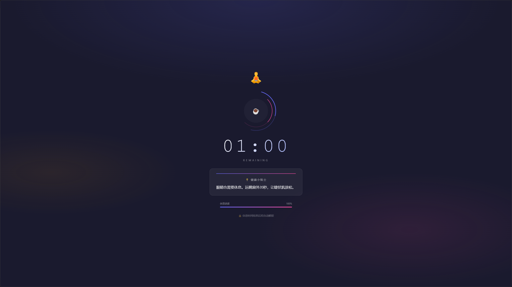
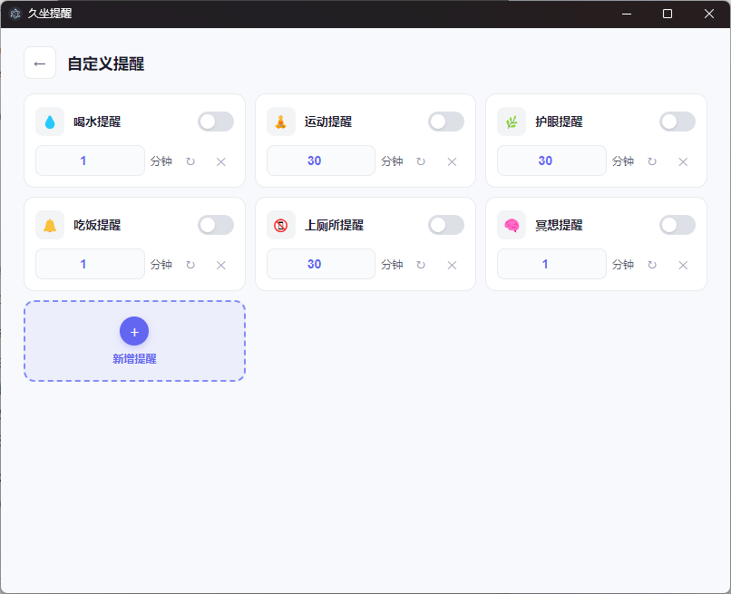
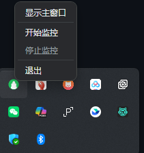
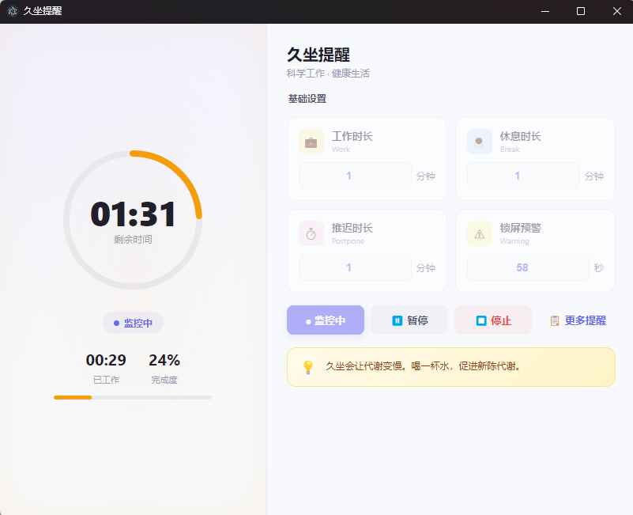
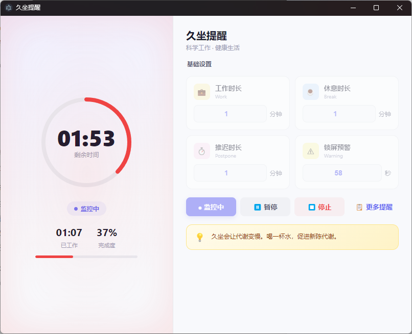

# StandUpReminder - 久坐提醒工具

> 一个基于 Electron 开发的 Windows 桌面应用，帮助您定时休息，保护腰椎健康

---

## 📌 项目背景

### 为什么做这个项目？

我自己一坐能坐一天14h，去年5月份的时候上班一个喷嚏把腰打闪了，一直到现在腰都还是疼，刚做板凳没几分钟就发胀，我才24呀！

但我肯定不是个例，我一直坚信我的问题，肯定也是很多人的问题，所以就有了这个工具！

自己懒得写了！让AI写吧！下面都是AI写的🙈

当代年轻人，正在被「久坐」慢慢毁掉。

来看看这些数据：

- 每天坐着超过 **8 小时**的办公族，腰椎长期处于压迫状态
- 久坐 1 小时，腰椎压力增加约 **40%**
- 长期前伸的坐姿，让颈椎每天额外承受 **10~15 斤** 的重量
- 中国超过 **2 亿人**存在颈椎亚健康问题，其中 30 岁以下占比超过 40%

这些问题在办公族、学生群体中尤为普遍。我们在电脑前专注工作或游戏，一坐就是几个小时，等到腰酸背痛、甚至出现颈纹加深时才意识到——**身体已经在悄悄透支**。

传统的解决办法要么靠意志力（定时提醒喝水），要么靠人工养生（按摩、健身），但都难以坚持。**我们需要的，是一个真正能强制你站起来休息的工具。**

> 💡 **"健康不是一种选择，而是一种习惯。而好习惯的养成，需要系统和工具来守护。"**

---

## 🎯 项目目标

本项目从**真实需求**出发，用 AI 完全开发（Trae），从 0 到 1 完成一款 Windows 桌面应用的完整开发流程。

最终交付物：**StandUpReminder** —— 一款会自动锁屏强制你休息的健康守护工具。

---

## 📸 功能介绍

### 1. 系统界面



主界面采用左右分栏布局，左侧是圆形进度环实时显示剩余时间，右侧是设置面板。通过简单的数字输入，配置你的工作时长、休息时长、推迟选项

### 2. 强制锁屏休息



到达设定时长后，应用将锁定你的屏幕，显示倒计时和健康小贴士。**无法跳过，无法忽视**——只有真正休息够了，才能继续工作。

### 3. 自定义健康提醒



不只是锁屏，应用还支持自定义提醒：喝水提醒（内置）、护眼提醒、运动提醒等，每个提醒独立倒计时，到点弹出通知。

### 4. 系统托盘后台运行



最小化到系统托盘，在后台默默守护。支持右键快捷操作：显示主窗口、开始/暂停监控、退出程序。

### 5. 推迟机制 + 警告提示


 

连续推迟 2 次后，窗口边缘会发出红色闪烁警告；第 3 次，系统将直接强制锁屏，**不再给警告窗口**。这一设计是为了防止用户无限推迟而失去提醒的意义。

---

## 🚀 项目运行

### 环境要求

- Windows 10 及以上
- Node.js 18+
- Git

### 克隆项目

```bash
git clone https://github.com/fsan10/StandUpReminder.git
```

### 安装依赖

```bash
npm install
```

### 启动开发

```bash
npm start
```

### 打包发布（Windows）

```bash
npm run dist
```

打包完成后，安装包在 `dist/` 目录下，双击即可安装使用。

---

## 🗂️ 项目结构

```
StandUpReminder/
├── main.js              # Electron 主进程（窗口管理、锁屏逻辑、定时器）
├── index.html           # 主界面（HTML 结构）
├── styles.css           # 全局样式（CSS 变量、组件样式、响应式布局）
├── lockscreen.html      # 全屏锁屏界面
├── notification.html    # 桌面通知弹窗（堆叠式）
├── prelock-warning.html # 预警弹窗
├── package.json         # 项目配置
├── assets/              # 图标资源
└── SPEC.md              # 设计文档
```

---

## 🧠 技术栈

| 技术 | 说明 |
|------|------|
| **Electron** | 跨平台桌面应用框架 |
| **Node.js** | 后端逻辑和系统交互 |
| **HTML/CSS/JS** | 前端界面，无需构建工具 |
| **Git** | 版本控制 |

---

## 🔧 核心功能实现

### 1. 自定义提醒功能

用户可自由添加新的提醒类型，每个提醒卡片显示名称、间隔时间、实时倒计时，支持开关、刷新、删除操作。

### 2. 锁屏强制机制

当工作时间到达，显示全屏遮罩窗口，`alwaysOnTop: true` + `skipTaskbar: true` 确保窗口置顶且无法通过任务栏切换。同时阻止鼠标键盘事件，让用户必须等待休息结束。

### 3. 设置持久化

所有用户设置（工作时长、休息时长、推迟时间、自定义提醒列表等）保存到本地 JSON 文件，下次打开应用自动恢复，无需重复配置。

---

## 📖 开发过程

本项目全程由 Trae 完全开发，我没有编写一行代码，感谢AI的强大。本项目完整记录在飞书知识库《Vibe Coding 实战项目库》中，包括：

- 📋 需求分析与功能设计
- 🎨 UI 设计与交互流程
- 💻 全流程提示词
- 🐛 Bug 修复记录（3轮重构迭代）
- 📦 打包发布流程

---

## 🔮 后续规划

### 1. 提醒语音包

支持多种语音提醒，不再只是单调的弹窗：

- 李云龙语音包，想想你多点了几次推迟，李云龙来一句'你他娘的'就能笑一整天
- 可自定义提醒语内容，如果后续条件允许的话接入AI，让李云龙给你撒娇也不是不可能

### 2. 数据统计

记录每日休息次数、总休息时长、推迟次数等数据，生成健康报告，帮助用户了解自己的久坐习惯。

---

## 📄 开源协议

MIT License — 欢迎 Fork、Star、提交 Issue 和 Pull Request

---

## 🙏 致谢

- [Electron](https://www.electronjs.org/) — 跨平台桌面应用框架
- [Trae](https://www.trae.cn/) — AI 代码编辑器，让开发效率大幅提升
- 所有为开源社区贡献代码和文档的开发者
